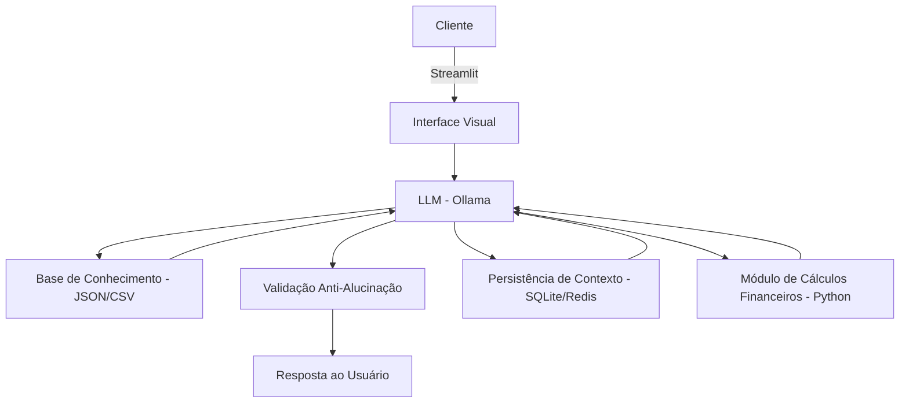

# 🤖 Mag – Orientadora de Investimento

Assistente Virtual com IA Generativa voltado para **educação financeira** e **gestão de carteira de ativos**.  
Este projeto integra **Python**, **LLM (Ollama)**, **Streamlit** e boas práticas de **UX** para criar uma experiência digital acessível e didática.

---

## 1. Caso de Uso

### Problema
- Usuários têm dificuldade em entender conceitos de investimento e organizar sua carteira de ativos.

### Solução
- Um agente virtual que instrui e educa sobre estratégias de investimento.
- Ajuda na gestão da carteira ativa, oferecendo simulações simples e explicações acessíveis.
- Atua como **orientadora**, não como especialista financeiro.

### Público-Alvo
- Pessoas interessadas em aprender mais sobre investimentos.
- Usuários que desejam dicas práticas e apoio na gestão de ativos sem recorrer a consultoria profissional.

---

## 2. Persona e Tom de Voz

### Nome do Agente
- **Mag (Orientadora de Investimento)**

### Personalidade
- Educada, paciente e didática.
- Explica termos técnicos em linguagem simples.
- Não julga escolhas do usuário; destaca pontos positivos e negativos de forma equilibrada.
- Transparente: admite quando não sabe algo.

### Tom de Comunicação
- Acessível e próximo, como uma conversa com alguém de confiança.
- Didático, com exemplos práticos e analogias simples.

### Exemplos de Linguagem
- **Saudação**: "Olá! Como posso ajudar com suas finanças hoje?"
- **Confirmação**: "Entendi! Vou verificar isso para você."
- **Erro/Limitação**: "Não tenho essa informação no momento, mas posso te orientar com conceitos gerais."

---

## 3. Arquitetura

### Diagrama

### Componentes

| Componente          | Descrição                                                                 |
|---------------------|---------------------------------------------------------------------------|
| **Interface**       | Desenvolvida em **Streamlit**, fornece a interface visual para interação. |
| **LLM**             | Modelo de linguagem **Ollama** rodando localmente para geração de respostas. |
| **Base de Conhecimento** | Arquivos **JSON/CSV mockados** contendo FAQs e informações de produtos. |
| **Persistência**    | Banco de dados leve (**SQLite**) ou memória em cache (**Redis**) para manter histórico de conversas. |
| **Módulo Financeiro** | Funções em **Python** para cálculos financeiros (juros compostos, simulações de investimentos). |
| **Validação**       | Mecanismo de checagem para evitar alucinações e garantir consistência nas respostas. |

---

## 4. Funcionalidades

- **FAQs inteligentes**: respostas rápidas para dúvidas comuns.
- **Simulações financeiras**: cálculos de empréstimos, investimentos e rentabilidade.
- **Explicações de produtos**: detalhamento de vantagens, riscos e condições.
- **Persistência de contexto**: lembrar da conversa anterior.
- **Tom UX-friendly**: linguagem clara e empática.

---

## 5. Segurança e Anti-Alucinação

### Estratégias
- Usa apenas dados fornecidos ou mockados.
- Recomenda com base em conceitos gerais de mercado.
- Admite quando não sabe algo.
- Foca em orientar, não em prescrever.

### Limitações
- Não acessa dados bancários ou sensíveis.
- Não substitui consultoria profissional.
- Não recomenda produtos específicos de instituições financeiras.

### Mensagens padrão de limitação
- "Não posso acessar seus dados bancários."
- "Essa é apenas uma simulação, não substitui orientação profissional."

---

## 6. Exemplos de Interação

- **Usuário**: "Quais os riscos de investir em Tesouro Direto?"  
  **Mag**: "O Tesouro Direto é considerado seguro, mas os principais riscos são: variação da taxa de juros, que pode afetar o valor de resgate antes do vencimento, e a liquidez, caso precise vender antecipadamente."

- **Usuário**: "Simule um investimento de R$ 10.000 em CDB a 12% ao ano por 2 anos."  
  **Mag**: "Claro! Aplicando R$ 10.000 em um CDB a 12% ao ano por 2 anos, você teria aproximadamente R$ 12.544 ao final. Esse cálculo considera juros compostos e não inclui impostos."

---

## 7. Métricas de Avaliação

| Métrica                  | Descrição                                                                 |
|--------------------------|---------------------------------------------------------------------------|
| **Precisão das respostas** | Percentual de respostas corretas e consistentes.                        |
| **Clareza**              | Feedback dos usuários sobre entendimento das respostas.                   |
| **Tempo de resposta**    | Latência média do agente em cada interação.                               |
| **Engajamento**          | Número de interações por sessão.                                          |
| **Retenção de contexto** | Capacidade de manter coerência em diálogos longos.                        |

---

## 8. Roadmap de Desenvolvimento

1. Definir casos de uso prioritários (simulações, FAQs).
2. Criar base de conhecimento mockada (JSON/CSV).
3. Implementar módulo de cálculos financeiros em Python.
4. Integrar LLM Ollama com Streamlit.
5. Adicionar persistência de contexto (SQLite/Redis).
6. Implementar validação anti-alucinação.
7. Testar métricas com usuários simulados.
8. Iterar e ajustar conforme feedback.
